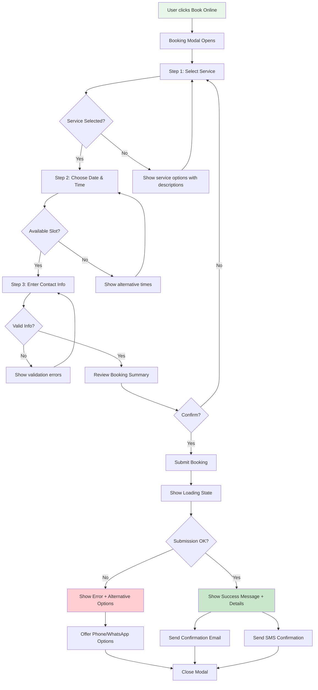
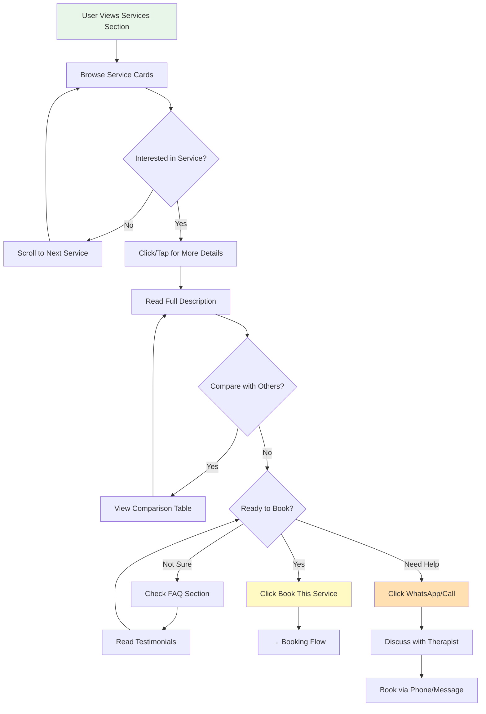
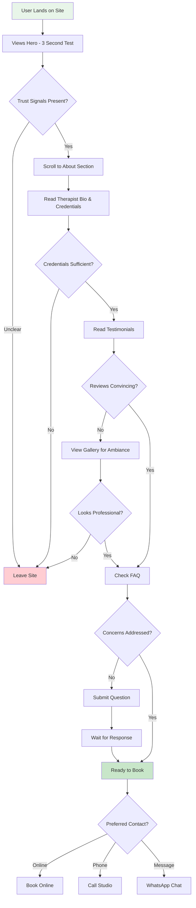

# SOMA STUDIO UI/UX Specification

**Version**: 2.0
**Date**: January 16, 2025
**Status**: Draft for Lovable Implementation

This document defines the user experience goals, information architecture, user flows, and visual design specifications for SOMA STUDIO's user interface. It serves as the foundation for visual design and frontend development, ensuring a cohesive and user-centered experience.

---

## Change Log

| Date | Version | Description | Author |
|------|---------|-------------|--------|
| 2025-01-16 | 2.0 | Complete UI/UX specification with improvements | Sally (UX Expert) |
| 2025-01-16 | 1.0 | Initial implementation (Lovable generated) | - |

---

## Introduction

### Overall UX Goals & Principles

#### Target User Personas

**Primary Persona: Stressed Professional (Ana, 35)**
- Works long hours in corporate environment
- Experiences chronic back/neck pain and stress
- Seeks genuine relaxation, not just "luxury spa"
- Values authenticity and professionalism
- Comfortable booking online, prefers convenience
- Bulgarian speaker, lives/works in Sofia
- Monthly income: Above average
- Tech-savvy: Uses smartphone for everything

**Secondary Persona: Wellness Enthusiast (Maria, 28)**
- Practices yoga, meditation, healthy lifestyle
- Seeks holistic, Eastern-inspired therapies
- Values natural, organic treatments
- Active on Instagram, shares experiences
- Willing to invest in quality wellness
- Researches thoroughly before booking
- Influenced by reviews and social proof

**Tertiary Persona: First-Time Spa Visitor (Dimitri, 42)**
- Never had professional massage
- Skeptical but curious about benefits
- Needs reassurance and clear expectations
- Prefers to call rather than book online
- Concerned about: What to wear, how it works, privacy
- Needs trust signals: credentials, testimonials

#### Usability Goals

1. **Ease of Booking**: Users can book an appointment in under 2 minutes via their preferred method (online form, phone, WhatsApp)
2. **Informed Decision-Making**: Users understand each service's benefits, duration, and pricing before booking
3. **Trust Building**: First-time visitors feel confident in therapist credentials and studio professionalism within 30 seconds
4. **Mobile Excellence**: 70% of users visit on mobile - experience must be flawless on phones
5. **Accessibility**: WCAG 2.1 AA compliance ensures all users can navigate and book
6. **Low Cognitive Load**: Single-page design with clear visual hierarchy prevents overwhelm

#### Design Principles

1. **Calm Before the Visit** - Every interaction should evoke tranquility, not stress. Use whitespace generously, soft animations, and reassuring copy.

2. **Transparency Builds Trust** - Show everything: prices upfront, therapist credentials, studio photos, client reviews. No hidden fees or surprises.

3. **Multiple Paths to Booking** - Users have different comfort levels. Offer online booking, phone call, WhatsApp, and contact form equally.

4. **Sensory Storytelling** - Help users imagine the experience through evocative imagery, descriptive language, and subtle animations that suggest touch and flow.

5. **Bulgarian-First, Mobile-First** - Design for Bulgarian language and mobile screens as the primary experience, not an afterthought.

---

## Information Architecture (IA)

### Site Map / Screen Inventory

```mermaid
graph TD
    A[Landing Page] --> B[Header - Sticky Navigation]
    A --> C[Hero - Value Proposition]
    A --> D[About - Therapist & Philosophy]
    A --> E[Services - 7 Therapy Options]
    A --> F[Why SOMA - Benefits & USPs]
    A --> G[Testimonials - Social Proof]
    A --> H[Gallery - Studio Ambiance]
    A --> I[FAQ - Common Questions]
    A --> J[Booking - Multiple Options]
    A --> K[Contact - Map & Info]
    A --> L[Footer - Quick Links]

    B --> B1[Logo/Home]
    B --> B2[Nav: Services]
    B --> B3[Nav: About]
    B --> B4[Nav: Contact]
    B --> B5[CTA: Book Online]
    B --> B6[Phone Button]
    B --> B7[Instagram Link]

    E --> E1[SOMA Ritual - Featured]
    E --> E2[Thai Massage]
    E --> E3[Classical Massage]
    E --> E4[Partial Back Massage]
    E --> E5[Aromatherapy Massage]
    E --> E6[Energy Therapy]
    E --> E7[Facial Massage]

    J --> J1[Online Booking Form]
    J --> J2[Phone Call CTA]
    J --> J3[WhatsApp Button]
    J --> J4[Contact Form]

    M[404 Error Page] --> A

    style A fill:#e8f5e9
    style E1 fill:#fff9c4
    style J fill:#ffe0b2
```



### Navigation Structure

**Primary Navigation (Header - Sticky):**
- Logo (click returns to top)
- Services (smooth scroll to #services)
- About (smooth scroll to #about)
- Gallery (smooth scroll to #gallery)
- Contact (smooth scroll to #contact)
- **CTA Button**: "Запазете час" (primary action, opens booking modal)

**Secondary Navigation:**
- Phone button (top right, always visible)
- Instagram icon (top right)
- WhatsApp floating button (bottom right, appears after scroll)

**Breadcrumb Strategy:**
- Not needed for single-page application
- 404 page includes "Return Home" link

**Mobile Navigation:**
- Hamburger menu (≤768px) containing:
  - Services
  - About
  - Gallery
  - FAQ
  - Contact
- Sticky CTA button at bottom of screen on mobile
- WhatsApp FAB (Floating Action Button) on mobile

---

## User Flows

### Flow 1: Book Appointment (Online - Primary Flow)

**User Goal:** Book a massage therapy session with specific date/time

**Entry Points:**
- Hero CTA button "Запазете час онлайн"
- Service card "Запази час" buttons
- Contact section booking form
- Floating WhatsApp button (alternative)

**Success Criteria:** User receives instant confirmation with booking details

#### Flow Diagram



#### Edge Cases & Error Handling

- **No available slots this week**: Show next week's availability + urgent contact option
- **Form validation errors**: Inline, real-time validation with clear Bulgarian messages
- **Submission failure**: Graceful degradation to phone/WhatsApp with copied details
- **Duplicate booking**: Check if phone/email already has appointment, offer to reschedule
- **After hours booking**: Confirm "We'll contact you tomorrow to confirm"
- **Network error**: Save form data locally, allow retry
- **Invalid phone number**: Real-time validation, suggest format (0888 XXX XXX)
- **Same-day booking**: Show message "For same-day, please call: 0888 333 424"

**Notes:**
- Booking form should have autosave (localStorage)
- Provide estimated response time: "Потвърждение до 2 часа"
- Include calendar integration link in confirmation

---

### Flow 2: Browse & Learn About Services

**User Goal:** Understand service options and choose the right one

**Entry Points:**
- Scroll from hero
- Click "Services" in navigation
- Direct link from external source (Google, Instagram)

**Success Criteria:** User understands services and proceeds to booking or contact

#### Flow Diagram



#### Edge Cases & Error Handling

- **User overwhelmed by 7 services**: Add filter/sort by concern (pain, stress, energy, beauty)
- **Unclear pricing**: Hover/tap shows breakdown, package deals
- **Uncertainty about right service**: Add "Not sure? Let us help" consultation request
- **Comparison paralysis**: Highlight most popular service (SOMA Ritual)
- **Mobile horizontal scroll**: Snap-to-grid for easy browsing

**Notes:**
- Consider adding "Good for: [back pain, stress, first-timers]" tags
- Include duration + price in card header for quick scanning
- Add "Add to Compare" feature for side-by-side analysis

---

### Flow 3: First-Time Visitor Trust Building

**User Goal:** Determine if SOMA STUDIO is legitimate and right for them

**Entry Points:**
- Landing on homepage (from Google search, Instagram, friend referral)

**Success Criteria:** User feels confident enough to book or contact

#### Flow Diagram



#### Edge Cases & Error Handling

- **Skeptical user**: Progressive disclosure of credentials (certifications, years experience, training)
- **Privacy concerns**: Add "What to expect" section explaining the process
- **Language barrier**: Ensure Bulgarian is clear, simple, welcoming
- **No social proof**: Add "As seen in" media mentions, Instagram follower count
- **Unknown location**: Embed Google Maps with reviews, show parking info

**Notes:**
- Add trust badges: "Licensed Therapist", "10+ Years Experience", "Certified in Thai Massage"
- Include video tour of studio (if available)
- Show before/after testimonials (emotional state, not physical)

---

## Wireframes & Mockups

**Primary Design Files:** Will be created in Lovable.dev based on this specification

### Key Screen Layouts

#### 1. Hero Section (Above the Fold)

**Purpose:** Immediately communicate value and provide primary CTA

**Key Elements:**
- Full-viewport background image (spa-hero.jpg) with gradient overlay
- Centered heading: "Преобразете се. Възстановете се. Открийте отново себе си."
- Subheading: "SOMA Ритуал - 90 минути холистична терапия за пълно възстановяване"
- Primary CTA: Large button "Запазете час онлайн" (opens booking modal)
- Secondary CTA: "Обадете се: 0888 333 424" (phone link)
- Trust badge: "⭐ 4.9/5 от 127+ клиента"
- Scroll indicator: Animated down arrow

**Interaction Notes:**
- Background image uses parallax scroll effect (subtle)
- CTA button has pulse animation to draw attention
- Phone number displays as clickable `tel:` link on mobile
- Heading animates in with fade + slide up effect

**Design File Reference:** TBD (Lovable)

---

#### 2. About / Therapist Section

**Purpose:** Build trust through credentials and personal connection

**Key Elements:**
- Left column: Therapist photo (professional, warm, approachable)
- Right column: Bio text
  - Name and credentials
  - Years of experience
  - Training/certifications
  - Philosophy statement
- Trust badges row:
  - "Сертифициран Тай масаж терапевт"
  - "10+ години опит"
  - "Над 500 доволни клиента"
- Background: Soft wellness-cream color

**Interaction Notes:**
- Photo has subtle zoom-in effect on scroll
- Credentials appear with stagger animation
- "Read more" expansion for full bio (mobile)

**Design File Reference:** TBD (Lovable)

---

#### 3. Services Grid

**Purpose:** Display all services with clear hierarchy and easy comparison

**Key Elements:**
- Featured service (SOMA Ritual): Full-width card, highlighted border
- Grid: 2 columns on desktop, 1 column on mobile
- Each card contains:
  - Service image (background)
  - Service name (heading)
  - Brief description (2-3 sentences)
  - Benefits list (3 bullet points with icons)
  - Duration + Price grid
  - "Запази час" CTA button
- Filter/sort bar: "Филтрирай по: [Цел] [Продължителност] [Цена]"

**Interaction Notes:**
- Cards have hover lift effect (desktop)
- Clicking card expands inline detail view
- "Add to Compare" checkbox (max 3 services)
- Smooth scroll to expanded card
- Price displays with currency symbol (лв)

**Design File Reference:** TBD (Lovable)

---

#### 4. Booking Modal

**Purpose:** Capture booking request with minimal friction

**Key Elements:**
- Multi-step form with progress indicator (3 steps)
- **Step 1**: Service selection (radio buttons with images)
- **Step 2**: Date picker (calendar) + Time slots (buttons)
- **Step 3**: Contact form (name, phone, email, notes)
- Summary sidebar: Selected service, date, time, price
- CTA: "Потвърди резервацията"
- Alternative: "Или се обадете: 0888 333 424"

**Interaction Notes:**
- Modal slides in from right
- Close button (X) with confirm dialog if form has data
- Autosave to localStorage
- Real-time validation with inline messages
- Loading spinner on submit
- Success state: Confetti animation + confirmation details

**Design File Reference:** TBD (Lovable)

---

#### 5. Testimonials Section

**Purpose:** Provide social proof through client stories

**Key Elements:**
- Heading: "Какво споделят нашите клиенти"
- Carousel of testimonial cards (3 visible on desktop)
- Each card:
  - 5-star rating (visual)
  - Quote text
  - Client name + service received
  - Optional: Client photo (avatar)
- Navigation: Prev/Next arrows + dot indicators
- Background: Subtle gradient (wellness-cream to white)

**Interaction Notes:**
- Auto-rotate every 5 seconds (pause on hover)
- Swipe gesture support on mobile
- Cards fade in/out during transition
- Click card to expand full testimonial

**Design File Reference:** TBD (Lovable)

---

#### 6. FAQ Accordion

**Purpose:** Answer common questions to reduce booking friction

**Key Elements:**
- Section heading: "Често задавани въпроси"
- Accordion with 8-10 common questions:
  - "Какво да нося на масаж?"
  - "Как да се подготвя?"
  - "Има ли паркинг?"
  - "Какви са методите за плащане?"
  - "Каква е политиката за отмяна?"
  - "Подходящ ли е за първи път?"
  - "Имате ли подаръчни карти?"
  - "Колко време преди трябва да пристигна?"

**Interaction Notes:**
- Click question to expand answer
- Smooth slide animation
- Only one open at a time
- Search/filter for questions (if 15+ FAQs)

**Design File Reference:** TBD (Lovable)

---

#### 7. Contact / Map Section

**Purpose:** Provide all contact methods and location information

**Key Elements:**
- Two-column layout:
  - Left: Contact info (phone, Instagram, address, hours)
  - Right: Embedded Google Map
- Booking CTA: "Готови за резервация?" with button
- Alternative contact: WhatsApp, phone, contact form
- Address with directions link

**Interaction Notes:**
- Map is interactive (zoom, directions)
- Phone numbers are `tel:` links
- Address links to Google Maps app
- Instagram link opens in new tab

**Design File Reference:** TBD (Lovable)

---

#### 8. 404 Error Page

**Purpose:** Helpful recovery from broken links

**Key Elements:**
- Centered layout with meditation icon 🧘‍♀️
- Heading: "Изглежда сте се отклонили от пътя"
- Message: "Но не се притеснявайте - винаги можете да се върнете към началото."
- CTA: "Върнете се към начало" button
- Quick links: Services, Contact, Book Appointment
- Background: Wellness-cream color

**Interaction Notes:**
- Button links to homepage (/)
- Maintain header/footer for context
- Gentle fade-in animation

**Design File Reference:** TBD (Lovable)

---

## Component Library / Design System

**Design System Approach:**
Extend shadcn/ui component library with custom SOMA STUDIO variants. Maintain Radix UI primitives for accessibility while overriding visual styles to match wellness brand.

### Core Components

#### Component: Button

**Purpose:** Primary interaction element for CTAs and actions

**Variants:**
- `primary`: Sage green background, white text (main booking CTA)
- `secondary`: Outlined sage green, transparent background (alternative actions)
- `accent`: Copper/warm tone for urgency (limited offers, "Book Now")
- `ghost`: Minimal style for less prominent actions
- `link`: Text-only for inline links

**States:**
- Default: Solid color with subtle shadow
- Hover: Slight lift (transform: translateY(-2px)) + increased shadow
- Active: Scale down (transform: scale(0.98))
- Disabled: 50% opacity, no interaction
- Loading: Spinner icon, disabled state

**Sizes:**
- `sm`: 32px height, 12px text
- `md`: 40px height, 14px text (default)
- `lg`: 48px height, 16px text (hero CTAs)
- `xl`: 56px height, 18px text (mobile sticky CTA)

**Usage Guidelines:**
- Use `primary` for main conversion actions (booking)
- Maximum 1 primary button visible per section
- Button text should be action-oriented verbs
- Include icons for phone/message buttons
- Ensure 44x44px minimum touch target on mobile

---

#### Component: ServiceCard

**Purpose:** Display service information with booking CTA

**Variants:**
- `featured`: Full-width, highlighted border, larger imagery (SOMA Ritual)
- `standard`: Regular grid item (other 6 services)
- `compact`: Minimal version for comparison view

**States:**
- Default: White background, subtle shadow
- Hover: Lift effect, image zoom, stronger shadow
- Expanded: Inline expansion showing full details
- Comparing: Checkbox selected, highlight border

**Key Elements:**
- Background image (service-specific)
- Service title (H3)
- Description (2-3 sentences)
- Benefits list (bullet points with icons)
- Duration/price grid
- "Запази час" CTA button

**Usage Guidelines:**
- Image should show hands/therapy in action
- Description should be 150-200 characters
- Always include benefits list (helps decision-making)
- Price should be prominent and upfront
- CTA button should stand out from card

---

#### Component: TestimonialCard

**Purpose:** Display client reviews for social proof

**Variants:**
- `carousel`: Used in testimonials section
- `inline`: Smaller version for service pages
- `featured`: Larger, highlighted testimonial

**States:**
- Default: White card with soft shadow
- Active: (in carousel) Full opacity
- Inactive: (in carousel) 80% opacity

**Key Elements:**
- 5-star rating (visual stars)
- Quote text (max 150 characters for carousel)
- Client name (first name + initial)
- Service received
- Optional: Client photo/avatar
- Date (relative: "2 weeks ago")

**Usage Guidelines:**
- Keep quotes authentic, not overly promotional
- Include specific service name
- Rotate testimonials to show variety
- Maximum 3 visible at once (carousel)

---

#### Component: BookingModal

**Purpose:** Multi-step form for online booking

**Variants:**
- `full`: Complete 3-step booking process
- `quick`: Simplified for returning customers

**States:**
- Step 1: Service selection
- Step 2: Date/time selection
- Step 3: Contact information
- Submitting: Loading state
- Success: Confirmation display
- Error: Error message + retry/alternative

**Key Elements:**
- Progress indicator (1 of 3, 2 of 3, 3 of 3)
- Step content area
- Summary sidebar (sticky on desktop)
- Navigation: Back, Next, Submit buttons
- Close button (X) with confirm dialog

**Usage Guidelines:**
- Must be keyboard accessible (Tab navigation)
- Real-time validation on Step 3
- Autosave form data to prevent loss
- Success state should include:
  - Booking ID
  - Confirmation email sent notice
  - Add to calendar link
  - Receipt/summary

---

#### Component: FAQAccordion

**Purpose:** Expandable question/answer interface

**Variants:**
- `default`: Standard accordion
- `searchable`: Includes search/filter bar

**States:**
- Collapsed: Question visible only
- Expanded: Question + answer visible
- Highlighted: Search match indicator

**Key Elements:**
- Question text (bold, clickable)
- Expand icon (chevron or plus)
- Answer text (revealed on expand)
- Smooth animation (200ms ease-out)

**Usage Guidelines:**
- Only one answer open at a time
- Question should be in user's language (conversational)
- Answer should be concise (2-4 sentences)
- Include links where relevant (e.g., "Call us at...")

---

## Branding & Style Guide

**Brand Guidelines:** SOMA STUDIO Visual Identity System (see below)

### Color Palette

| Color Type | Hex Code | HSL | Usage |
|------------|----------|-----|-------|
| **Primary (Sage)** | #6B8E6F | hsl(100, 20%, 45%) | Main brand color, buttons, links, headers |
| **Primary Light** | #8FAF92 | hsl(100, 25%, 65%) | Hover states, light backgrounds, accents |
| **Primary Dark** | #4F6B51 | hsl(100, 15%, 35%) | Active states, footer, high contrast text |
| **Accent (Copper)** | #C17A5C | hsl(18, 48%, 55%) | Urgency, limited offers, featured items |
| **Background** | #F9F7F4 | hsl(40, 15%, 97%) | Page background, light sections |
| **Wellness Cream** | #F5F1EB | hsl(40, 25%, 94%) | Alternating sections, cards |
| **Wellness Earth** | #D9C7B8 | hsl(35, 20%, 75%) | Decorative elements, dividers |
| **Success** | #4CAF50 | hsl(122, 39%, 49%) | Positive feedback, confirmations |
| **Warning** | #FF9800 | hsl(36, 100%, 50%) | Cautions, important notices |
| **Error** | #F44336 | hsl(4, 90%, 58%) | Errors, destructive actions, validation |
| **Neutral Gray** | #4A4A4A | hsl(0, 0%, 29%) | Body text, borders |
| **Light Gray** | #E0E0E0 | hsl(0, 0%, 88%) | Borders, disabled states |

**Color Usage Notes:**
- All colors use HSL format for easy theming
- Primary sage conveys nature, healing, growth
- Accent copper adds warmth without being aggressive
- Neutral tones create calm, spa-like atmosphere
- Ensure 4.5:1 contrast ratio for text (WCAG AA)

---

### Typography

#### Font Families

**Primary (Headings):**
```css
font-family: 'Playfair Display', 'Georgia', serif;
```
- Elegant, sophisticated serif
- Use for: H1, H2, H3, brand name
- Weights: 400 (regular), 700 (bold)
- Fallback: Georgia, Times New Roman, serif

**Secondary (Body):**
```css
font-family: 'Inter', 'Segoe UI', 'Helvetica Neue', sans-serif;
```
- Clean, highly readable sans-serif
- Use for: Paragraphs, buttons, UI elements
- Weights: 300 (light), 400 (regular), 500 (medium), 600 (semibold)
- Fallback: System font stack for performance

**Monospace (Code/Numbers):**
```css
font-family: 'JetBrains Mono', 'Courier New', monospace;
```
- Use sparingly for: Prices, booking IDs, technical info

#### Type Scale

| Element | Size (Desktop) | Size (Mobile) | Weight | Line Height | Usage |
|---------|----------------|---------------|--------|-------------|--------|
| **H1** | 56px (3.5rem) | 36px (2.25rem) | 700 | 1.1 | Hero headline only |
| **H2** | 40px (2.5rem) | 28px (1.75rem) | 700 | 1.2 | Section headings |
| **H3** | 28px (1.75rem) | 22px (1.375rem) | 600 | 1.3 | Service names, subsections |
| **H4** | 20px (1.25rem) | 18px (1.125rem) | 600 | 1.4 | Card titles, subheadings |
| **Body Large** | 18px (1.125rem) | 16px (1rem) | 400 | 1.7 | Hero subheading, intros |
| **Body** | 16px (1rem) | 15px (0.938rem) | 400 | 1.6 | Paragraphs, descriptions |
| **Small** | 14px (0.875rem) | 13px (0.813rem) | 400 | 1.5 | Captions, meta info |
| **Tiny** | 12px (0.75rem) | 12px (0.75rem) | 500 | 1.4 | Labels, badges, legal |

**Typography Guidelines:**
- Use Playfair Display sparingly (headings only) to maintain elegance
- Inter for all body text ensures readability
- Increase line-height for Bulgarian Cyrillic (more vertical space)
- Never use ALL CAPS for long text (accessibility issue)
- Uppercase with letter-spacing for short labels: `text-transform: uppercase; letter-spacing: 0.05em;`

---

### Iconography

**Icon Library:** Lucide React (currently in use, maintain consistency)

**Icon Style:**
- Outline style (not filled)
- 24px default size (can scale to 16px, 20px, 32px)
- Stroke width: 2px
- Match primary color or inherit text color

**Common Icons:**
- Phone: `<Phone />` - Contact CTAs
- Instagram: `<Instagram />` - Social links
- MapPin: `<MapPin />` - Location/address
- Clock: `<Clock />` - Duration indicators
- Calendar: `<Calendar />` - Booking/schedule
- Check: `<Check />` - Confirmation, benefits
- ChevronDown: `<ChevronDown />` - Accordion, dropdowns
- X: `<X />` - Close modals
- Menu: `<Menu />` - Mobile hamburger
- Star: `<Star />` - Ratings
- Loader: `<Loader />` - Loading states

**Usage Guidelines:**
- Always include `aria-hidden="true"` for decorative icons
- Pair with text labels for clarity (icon + "Обади се")
- Use consistent size within a component
- Never use icon alone for critical actions (accessibility)

---

### Spacing & Layout

**Grid System:**
```css
/* Container max-widths */
--container-sm: 640px;  /* Mobile landscape */
--container-md: 768px;  /* Tablet */
--container-lg: 1024px; /* Desktop */
--container-xl: 1280px; /* Wide desktop */

/* Content max-widths */
--prose-width: 65ch;    /* Readable text */
--card-grid-max: 1200px; /* Service cards */
```

**Spacing Scale (Based on 8px grid):**
```css
--space-1: 0.25rem;  /* 4px - Tight spacing */
--space-2: 0.5rem;   /* 8px - Base unit */
--space-3: 0.75rem;  /* 12px */
--space-4: 1rem;     /* 16px - Standard spacing */
--space-5: 1.5rem;   /* 24px */
--space-6: 2rem;     /* 32px - Section padding */
--space-8: 3rem;     /* 48px */
--space-10: 4rem;    /* 64px - Large gaps */
--space-12: 6rem;    /* 96px - Section spacing */
--space-16: 8rem;    /* 128px - Hero spacing */
```

**Layout Guidelines:**
- Use 8px base grid for all spacing
- Section padding: `py-16` (64px) on desktop, `py-12` (48px) on mobile
- Container padding: `px-4` (16px) on mobile, `px-6` (24px) on tablet+
- Card gaps: `gap-8` (32px) on desktop, `gap-6` (24px) on mobile
- Generous whitespace = calm, luxury feeling

---

## Accessibility Requirements

### Compliance Target

**Standard:** WCAG 2.1 Level AA

**Rationale:**
- Level AA is industry standard for commercial websites
- Ensures usability for users with visual, motor, and cognitive disabilities
- Required for government contracts and many B2B clients
- Level AAA is aspirational but not required

---

### Key Requirements

**Visual:**
- **Color contrast ratios:**
  - Normal text: 4.5:1 minimum
  - Large text (18px+): 3:1 minimum
  - UI components: 3:1 minimum
  - Test with WebAIM Contrast Checker

- **Focus indicators:**
  - Visible outline on all interactive elements
  - Minimum 2px outline, high contrast color
  - Never remove outlines (use `:focus-visible` instead)

- **Text sizing:**
  - User can zoom to 200% without loss of content
  - Use `rem` units, not `px`
  - Minimum font size: 14px (0.875rem)

**Interaction:**
- **Keyboard navigation:**
  - All interactive elements reachable via Tab
  - Logical tab order (top to bottom, left to right)
  - Skip to main content link
  - Arrow keys for carousel/slider navigation
  - Escape key closes modals
  - Enter/Space activates buttons

- **Screen reader support:**
  - Semantic HTML (`<header>`, `<nav>`, `<main>`, `<footer>`)
  - ARIA labels for icons and image buttons
  - ARIA live regions for dynamic content
  - Form labels associated with inputs
  - Status messages announced

- **Touch targets:**
  - Minimum 44x44px on mobile (Apple HIG)
  - Adequate spacing between touch targets (8px minimum)
  - No hover-only interactions on mobile

**Content:**
- **Alternative text:**
  - All images have descriptive `alt` text
  - Decorative images: `alt=""`
  - Icon buttons: `aria-label="Call SOMA STUDIO"`

- **Heading structure:**
  - Only one `<h1>` per page
  - No skipped levels (h2 → h4)
  - Headings describe content structure

- **Form labels:**
  - Every input has associated `<label>`
  - Use `placeholder` for hints, not labels
  - Error messages linked via `aria-describedby`

---

### Testing Strategy

**Automated Testing:**
- Run axe DevTools on every build
- Lighthouse accessibility audit (score 95+)
- pa11y CI in GitHub Actions

**Manual Testing:**
- Keyboard-only navigation testing
- Screen reader testing (NVDA on Windows, VoiceOver on Mac)
- Color blindness simulator (Chromatic, Stark)
- Zoom testing (200%, 400%)

**User Testing:**
- Include users with disabilities in usability testing
- Test with real assistive technology users
- Gather feedback on pain points

**Acceptance Criteria:**
- Zero critical axe violations
- Lighthouse accessibility: 95+
- All user flows completable with keyboard only
- Screen reader announces all interactive elements

---

## Responsiveness Strategy

### Breakpoints

| Breakpoint | Min Width | Max Width | Target Devices |
|------------|-----------|-----------|----------------|
| **Mobile** | 320px | 767px | iPhone SE, iPhone 12/13/14, Android phones |
| **Tablet** | 768px | 1023px | iPad, Android tablets, small laptops |
| **Desktop** | 1024px | 1439px | Laptops, desktop monitors |
| **Wide** | 1440px | - | Large monitors, 4K displays |

**Tailwind Breakpoints (Default):**
```css
sm: 640px
md: 768px
lg: 1024px
xl: 1280px
2xl: 1536px
```

---

### Adaptation Patterns

**Layout Changes:**
- **Mobile (<768px):**
  - Single column layout
  - Stack all grids vertically
  - Full-width cards
  - Sticky header (reduced height)
  - Floating WhatsApp button

- **Tablet (768-1023px):**
  - 2-column grid for services
  - Side-by-side content where appropriate
  - Maintain hierarchy

- **Desktop (1024px+):**
  - Multi-column layouts (2-3 columns)
  - Horizontal service grid
  - Sidebar layouts for modals
  - Hover effects enabled

**Navigation Changes:**
- **Mobile:** Hamburger menu
- **Tablet:** Horizontal navigation (may truncate)
- **Desktop:** Full navigation with dropdowns (if needed)

**Content Priority:**
- **Mobile-first approach:**
  - Most important content first
  - Progressive disclosure (expandable sections)
  - Simplified testimonials (1 at a time)

- **Desktop enhancements:**
  - Show more content simultaneously
  - Side-by-side comparisons
  - Larger images, more whitespace

**Interaction Changes:**
- **Mobile:**
  - Touch-friendly: 44x44px targets
  - Swipe gestures for carousel
  - Bottom sheet modals (not centered)
  - Sticky CTA button at bottom

- **Desktop:**
  - Hover effects (lift, zoom)
  - Tooltips on hover
  - Centered modals
  - Keyboard shortcuts enabled

---

## Animation & Micro-interactions

### Motion Principles

**Purposeful Motion:**
- Every animation must have a purpose (feedback, guidance, delight)
- No animation for decoration alone
- Respect `prefers-reduced-motion` user setting

**Natural Timing:**
- Use easing curves that mimic real-world physics
- Fast in, slow out: `cubic-bezier(0.4, 0, 0.2, 1)`
- Bounce sparingly (success states only)
- Duration: 150-400ms for most transitions

**Smooth Performance:**
- Animate only `transform` and `opacity` (GPU-accelerated)
- Avoid animating `height`, `width`, `top`, `left` (reflow)
- Use `will-change` sparingly
- Test on low-end devices (60fps minimum)

**Accessibility:**
- Provide `@media (prefers-reduced-motion: reduce)` fallback
- Disable auto-play animations for reduced motion users
- Never rely on animation alone to convey information

---

### Key Animations

- **Page Load (Hero):** Fade in + slide up (500ms, ease-out) - Draws attention to value proposition
- **Scroll Reveal (Sections):** Fade in + slide up (400ms, ease-out, stagger 100ms) - Progressive content reveal feels natural
- **Button Hover:** Transform: translateY(-2px) + shadow (200ms, ease-out) - Affordance signaling clickability
- **Button Click:** Transform: scale(0.98) (150ms, ease-in-out) - Haptic feedback for action confirmation
- **Card Hover:** Transform: translateY(-4px) + shadow (300ms, ease-out) - Depth and interactivity
- **Modal Open:** Slide in from right + overlay fade (350ms, ease-out) - Directional cue, overlay establishes context
- **Modal Close:** Slide out to right + overlay fade (250ms, ease-in) - Faster close feels responsive
- **Accordion Expand:** Height auto + rotate chevron (250ms, ease-out) - Smooth disclosure
- **Loading Spinner:** Rotate infinite (800ms, linear) - Indicates processing
- **Success Checkmark:** Scale + checkmark draw (600ms, ease-out) - Celebration moment
- **Error Shake:** Horizontal shake -10px to 10px (400ms, ease-in-out) - Attention grabbing
- **Carousel Transition:** Fade + slide (500ms, ease-in-out) - Smooth content change
- **Image Zoom (Hover):** Transform: scale(1.05) (400ms, ease-out) - Engagement cue
- **Scroll Indicator (Hero):** Bounce infinite (2s, ease-in-out) - Guides user action
- **WhatsApp FAB Appear:** Scale 0 to 1 + bounce (400ms, cubic-bezier(0.68, -0.55, 0.265, 1.55)) - Playful entrance

---

## Performance Considerations

### Performance Goals

- **Page Load:** First Contentful Paint < 1.5s, Largest Contentful Paint < 2.5s
- **Interaction Response:** Time to Interactive < 3s, First Input Delay < 100ms
- **Animation FPS:** 60fps for all animations, no janky scrolling

**Measurement:**
- Lighthouse Performance Score: 90+
- Core Web Vitals: All green
- Test on: Fast 3G, Slow 4G, Desktop

---

### Design Strategies

**Image Optimization:**
- Use WebP format with JPEG fallback
- Responsive images: ``
- Lazy load below-the-fold images: `loading="lazy"`
- Hero image: Priority load (`loading="eager"`, `fetchpriority="high"`)
- Compress all images: TinyPNG, Squoosh (target: <200KB per image)
- Use blur placeholder while loading (LQIP - Low Quality Image Placeholder)

**Font Loading:**
- Preload critical fonts: `<link rel="preload" href="..." as="font">`
- Use `font-display: swap` to avoid FOIT (Flash of Invisible Text)
- Subset fonts to only needed characters (Latin + Cyrillic)
- Consider variable fonts to reduce file size

**Code Splitting:**
- Lazy load booking modal (not needed immediately)
- Lazy load FAQ, Gallery, Testimonials (below fold)
- Defer non-critical JavaScript
- Use dynamic imports: `const Booking = lazy(() => import('./Booking'))`

**Resource Hints:**
- `dns-prefetch` for Instagram, Google Maps
- `preconnect` for font CDNs
- `prefetch` for likely next pages (if multi-page in future)

**Asset Delivery:**
- Use CDN for static assets
- Enable Gzip/Brotli compression
- Set cache headers: `Cache-Control: public, max-age=31536000` for versioned assets
- Inline critical CSS (above-the-fold)

**Perceived Performance:**
- Skeleton screens while loading (ServiceCard placeholders)
- Optimistic UI updates (instant feedback before server response)
- Progress indicators for loading states
- Prefetch data on hover (predict user intent)

---

## Next Steps

### Immediate Actions

1. **Create visual designs in Lovable.dev** using this specification
2. **Generate component library** with proper variants and states
3. **Implement online booking form** with multi-step flow and validation
4. **Add testimonials section** (collect client reviews first)
5. **Create About section** (draft therapist bio, gather credentials)
6. **Build FAQ accordion** (compile common questions from phone inquiries)
7. **Add WhatsApp integration** (set up business account, create auto-reply)
8. **Optimize images** (compress all 8 service images + hero)
9. **Implement analytics** (Google Analytics 4 or Plausible for privacy)
10. **Set up A/B testing** (test CTA variations)

### Design Handoff Checklist

- [ ] All user flows documented and validated
- [x] Component inventory complete (ServiceCard, Button, Modal, etc.)
- [x] Accessibility requirements defined (WCAG 2.1 AA)
- [x] Responsive strategy clear (mobile-first, 4 breakpoints)
- [x] Brand guidelines incorporated (colors, typography, spacing)
- [x] Performance goals established (LCP < 2.5s, FID < 100ms)
- [ ] Visual designs created in Lovable (pending)
- [ ] Content finalized (About bio, FAQs, testimonials)
- [ ] Backend requirements defined (booking form submission)
- [ ] Analytics implementation planned

---

## Appendix: UX Review Summary

This specification is based on comprehensive UX review findings (see `docs/UX-UI-REVIEW.md`). Key improvements implemented:

### High Priority ✅
1. **Online Booking System** - Multi-step modal with instant confirmation
2. **Social Proof** - Testimonials section with carousel
3. **About Section** - Therapist credentials and trust building
4. **FAQ** - Comprehensive accordion for common questions
5. **WhatsApp Integration** - FAB for mobile messaging
6. **Enhanced CTAs** - Primary/secondary hierarchy with urgency

### Medium Priority ✅
7. **Custom Typography** - Playfair Display + Inter for brand consistency
8. **Accent Color** - Copper for urgency and featured items
9. **Gallery Section** - Studio ambiance photos
10. **Service Comparison** - Side-by-side feature

### Future Enhancements 🔮
- Package deals and pricing tiers
- Gift certificates
- Membership/loyalty program
- Blog for SEO (wellness tips, massage education)
- Multi-language support (English for tourists)
- Dark mode toggle (already in CSS, needs UI)

---

**Document Status:** Ready for Lovable.dev implementation
**Next Step:** Generate AI prompt for Lovable
**Maintained by:** Sally 🎨 (UX Expert)
